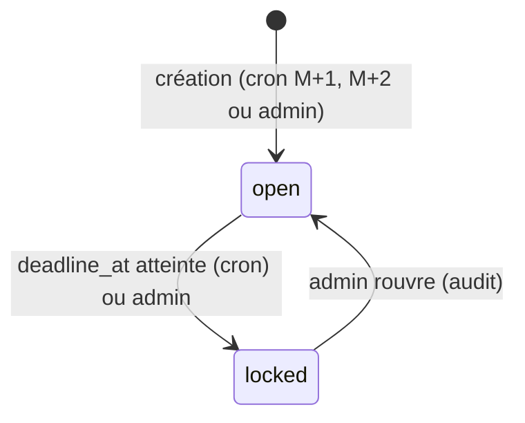
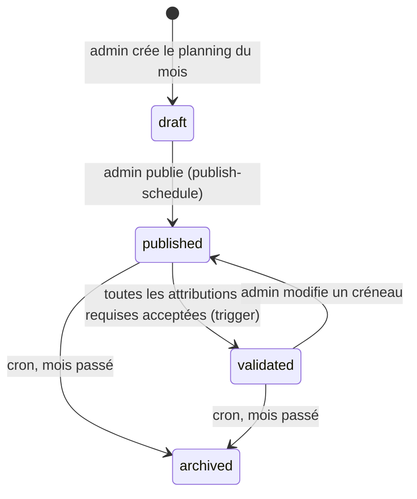
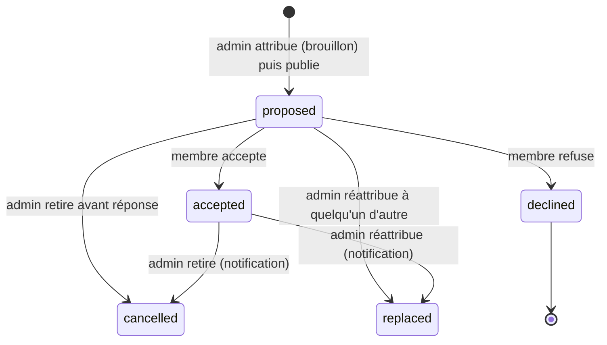
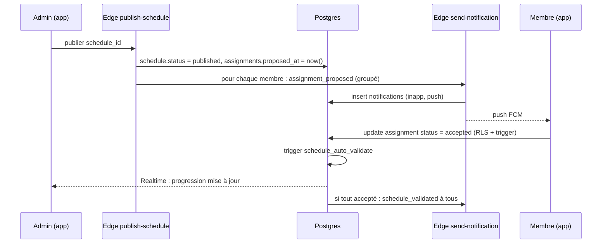
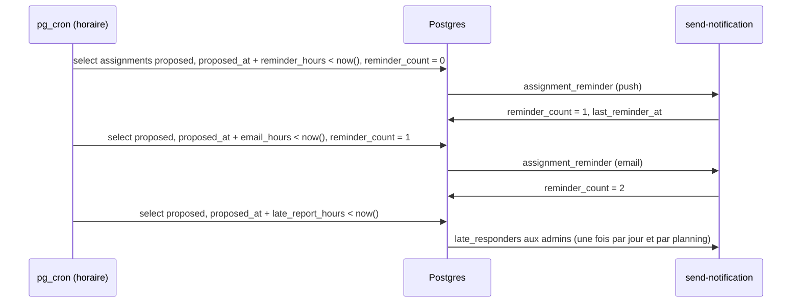

# Workflows et machines à états

## 1. Période de saisie (`periods.status`)



Règles :
- Les membres écrivent leurs disponibilités uniquement en `open`.
- L'admin écrit toujours, avec `set_by` renseigné et audit si `set_by <> user_id`.
  `set_by` est **imposé** par le déclencheur `availabilities_trace_auteur` (migration `0012`) :
  ce que le client envoie dans cette colonne est ignoré.
- **Rouvrir, c'est dire jusqu'à quand.** La transition `locked → open` exige une
  `deadline_at` future (`period_reopen_deadline_passed`, migration `0012`) : la tâche
  `lock_periods` passe toutes les heures, et une période rouverte sans nouvelle date limite
  serait reverrouillée dans l'heure. L'écran d'administration demande donc la nouvelle date
  limite dans le même geste que la réouverture.
- `locked_at` n'est jamais écrit par le client : le déclencheur le pose au verrouillage et
  l'efface à la réouverture.

## 2. Planning (`schedules.status`)



Règles :
- `draft` est invisible des membres.
- `published` : chaque membre voit ses propres attributions et peut répondre.
- `validated` : tous les membres voient le planning complet.
- Une modification en `validated` renvoie le planning en `published` et ne touche que les
  attributions modifiées.

## 3. Attribution (`assignments.status`)



Règles :
- Un membre passe uniquement de `proposed` à `accepted` ou `declined`.
- `replaced` porte `replaced_by` vers la nouvelle attribution. **Un refus et une annulation
  aussi** : ils gardent leur statut — c'est l'histoire de la caserne, et elle a déjà été notifiée
  sous ce nom — et leur `replaced_by` dit quelle attribution a comblé le trou (migration `0020`).
- **Les états terminaux sont à sens unique, et hors de portée d'un client** (migration `0020`).
  `declined`, `replaced` et `cancelled` ne s'écrivent ni par une insertion ni par une mise à jour
  cliente, et on n'en **sort** pas : l'historique de la caserne ne se réécrit pas. Le motif d'un
  refus est gelé. Ces écritures passent par `reassign_shift` ou `cancel_assignment`, qui préviennent
  le pompier concerné dans la même transaction : un changement d'état qui ne se dit pas laisse
  quelqu'un se croire d'astreinte.
- **Une réattribution remplace, elle n'ajoute pas.** Le nombre d'attributions actives d'un créneau ne
  dépasse jamais son effectif requis : `reassign_shift` compte les places après avoir pris ses
  verrous et refuse en `shift_already_filled` sinon. Renforcer un créneau publié se dit autrement —
  en augmentant son effectif requis.
- **La notification marque les transitions venues d'`accepted`, et elles seules.** Retirer une
  proposition sans réponse ne prévient personne : rien n'était acquis, et l'écran « Propositions »
  du membre sera simplement plus court.
- En brouillon, les attributions existent avec `status = 'proposed'` et `proposed_at = null`.
  La publication renseigne `proposed_at`. Les crons de relance ignorent `proposed_at is null`.
  Une attribution née d'une réattribution est horodatée **dès sa création** : elle est partie.

## 4. Séquence : publication et validation



## 5. Séquence : refus et réattribution

```mermaid
sequenceDiagram
  participant M1 as Membre initial
  participant DB as Postgres
  participant N as send-notification
  participant A as Admin
  participant EF as Edge reassign-shift
  participant M2 as Nouveau membre

  M1->>DB: status = declined, decline_reason
  DB->>N: assignment_declined à l'admin
  N-->>A: push "X a refusé le 12 nuit"
  A->>EF: réattribuer shift_id à M2
  EF->>DB: reassign_shift — une transaction
  DB->>DB: ancienne reste declined, replaced_by posé ; nouvelle proposed, proposed_at = now()
  DB->>N: assignment_proposed à M2 uniquement
  N-->>M2: push
  DB->>DB: schedule_reevaluer — le planning reste publié
```

**Le compte, c'est un.** Un refus suivi d'une réattribution ne produit qu'une notification, au
nouveau membre. Le refus a déjà produit la sienne — `assignment_declined` aux administrateurs — au
moment où il a été prononcé. Rien n'est renvoyé au reste de la caserne : c'est exactement ce que
l'outil remplacé imposait, et la raison d'être du ticket 020.

Les variantes du même geste :

| Ce que remplace la réattribution | Ancienne attribution | Nouveau membre | Ancien membre |
|---|---|---|---|
| un refus | reste `declined`, `replaced_by` posé | `assignment_proposed` | rien |
| une annulation | reste `cancelled`, `replaced_by` posé | `assignment_proposed` | rien : il a déjà été prévenu |
| une proposition sans réponse | `replaced` | `assignment_proposed` | rien |
| une garde acceptée | `replaced` | `assignment_proposed` | `assignment_cancelled` |
| un créneau vide | — | `assignment_proposed` | — |

**Annuler** (`cancel_assignment`) suit la même règle : `accepted → cancelled` prévient le membre
avec le motif, `proposed → cancelled` ne prévient personne.

Dans les deux cas, une acceptation qui disparaît fait repasser le planning de `validated` à
`published` (§ 2) : seuls les créneaux touchés changent d'état, `published_at` ne se réécrit pas, et
personne n'est notifié de ce recul — la conséquence est déjà partie à qui de droit.

## 6. Séquence : relances



## 7. Cycle de vie d'un mois (vue d'ensemble)

| Moment | Événement |
|---|---|
| 1er de M-2 | La période M est créée, ouverte à la saisie |
| J-3 avant deadline | Push de rappel aux membres sans saisie |
| J-1 | Email de rappel |
| Deadline (ex. 15 de M-1) | Période verrouillée |
| M-1, semaine 3 | L'admin construit le brouillon, publie |
| +24 h | Rappel push aux non-répondants |
| +48 h | Email aux non-répondants |
| +72 h | Rapport des retardataires à l'admin |
| Tout accepté | Planning validé, visible de tous |
| Pendant M | Modifications ponctuelles, notifications ciblées |
| 1er de M+1 | Planning archivé |

## 8. Notifications par événement

| Type | Destinataire | Canaux | Regroupement |
|---|---|---|---|
| `invitation` | invité | email | non |
| `availability_reminder` | membres sans saisie | push J-3, email J-1 | un par membre |
| `assignment_proposed` | membre attribué | push + inapp | oui, par publication |
| `assignment_reminder` | membre sans réponse | push puis email | par membre |
| `assignment_declined` | admins de la caserne | push + inapp | non |
| `assignment_changed` | membre concerné | push + inapp | non |
| `assignment_cancelled` | membre concerné | push + inapp | non |
| `schedule_validated` | tous les membres | push + inapp | oui |
| `schedule_all_accepted` | admins | push + inapp | non |
| `late_responders` | admins | inapp + push | un par jour et par planning |

Deep links (`notifications.data.route`) :
- `/proposals` : écran des propositions en attente.
- `/schedule/<period>` : planning de la caserne.
- `/admin/schedule/<period>` : suivi admin.
- `/availability/<period>` : saisie du mois.
