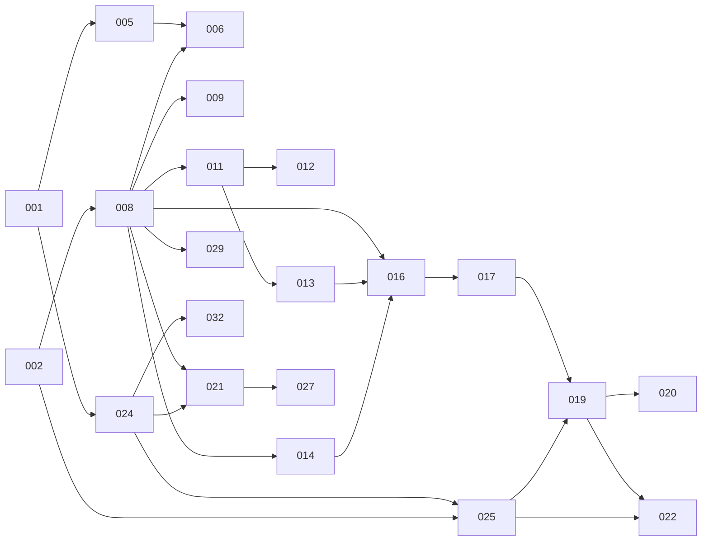

# Tickets

Un ticket = une PR. Le suivi se fait par déplacement du fichier entre trois dossiers :

| Dossier | Signification |
|---|---|
| `backlog/` | À faire |
| `in-progress/` | En cours, une branche `feat/<numéro>-<slug>` existe |
| `done/` | Terminé, la PR est créée (le lien est dans le ticket) |

Le tableau à jour est généré dans [BOARD.md](BOARD.md). Ne pas déplacer les fichiers à la
main : utiliser `scripts/ticket.sh` (voir `CLAUDE.md`), qui déplace, commite et ouvre la PR.

```
scripts/ticket.sh next          # tickets prêts (dépendances terminées)
scripts/ticket.sh start 011     # backlog → in-progress, commit sur main, branche feat/011-…
scripts/ticket.sh pr 011        # in-progress → done, push, création de la PR, lien ajouté au ticket
scripts/ticket.sh board         # régénère BOARD.md
```

Priorités : P0 = nécessaire au MVP, P1 = MVP souhaitable, peut glisser en v1.1.

## Ordre de réalisation conseillé

### Jalon 1 — Socle (semaine 1 à 2)
001 Initialiser le projet Flutter · 002 Projet Supabase et migrations · 008 RLS et fonctions d'accès · 004 Thème et composants · 003 CI

### Jalon 2 — Entrer dans l'app (semaine 3)
005 Connexion OTP · 006 Invitations et onboarding · 009 Gestion des membres · 010 Paramètres de la caserne · 007 Profil

### Jalon 3 — Disponibilités (semaine 4 à 5)
011 Grille de saisie · 012 Raccourcis · 013 Préférences de charge · 014 Périodes et verrouillage

### Jalon 4 — Notifications (semaine 6)
024 FCM trois plateformes · 025 Edge send-notification · 015 Rappels de saisie · 026 Centre de notifications

### Jalon 5 — Planning et validation (semaine 7 à 9)
016 Matrice admin · 017 Brouillon et attribution · 019 Publication et suivi · 021 Écran propositions · 020 Réattribution · 022 Relances automatiques · 027 Mes astreintes · 018 Proposition automatique · 023 Planning de la caserne · 028 Export ICS

### Jalon 6 — Monétisation et sortie (semaine 10 à 12)
029 Abonnement Stripe · 032 Build web PWA et déploiement · 030 Mode suspendu · 031 Super-admin · 034 RGPD · 035 Tests bout en bout · 033 Stores iOS et Android

## Graphe de dépendances (P0)



## Format d'un ticket

```
# <numéro> — <titre>
- Épopée, Priorité, Dépend de, Branche, Statut (géré par le script), PR (ajouté par le script)
## Contexte (facultatif)
## À faire
## Critères d'acceptation
## Hors périmètre (facultatif)
```
